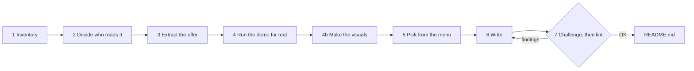

# 📘 GitHub README Writer

*Read every file, run every command, then write the README a stranger can use.*

**A skill for Claude (or any AI agent) that inventories a repository file by file, runs its commands in a scratch copy, and writes a README with real output and only the sections the repo needs.**

  

**Status:** working, checked 2026-09-10. No LICENSE file yet.

## What is it?

Point it at a folder. It reads every file, runs the repo's own commands, and writes a README whose every claim was checked against the code that day — for the developer or PM who lands on the repo with no context.

```bash
python3 inventory.py ~/Downloads/workflow-studio        # writes readme-inventory.md: every file, ticked as you read
python3 lint.py ~/Downloads/workflow-studio/README.md   # exit 1 on a broken link, bad anchor, placeholder, filler word
```

> Are you the agent running this skill? Read [SKILL.md](SKILL.md) — that is the procedure. This page is for the person deciding whether to use it.

## Why this and not a README template?

- **Nothing skipped.** [`inventory.py`](inventory.py) lists every file with size, kind, a summary in the file's own words, and what it lets a user run. The writer ticks each line; an unticked line is a visible gap.
- **Nothing invented.** Every command was run in a scratch folder; every output is what it printed. Dependencies come from the imports — the `yaml` line [in the run below](#what-does-a-run-look-like) was one nobody had declared.
- **A second pass that cuts.** [CHALLENGER.md](CHALLENGER.md) reads the draft as three readers on three clocks, demands proof for every claim, and deletes any section the reader would not miss.
- **A linter that fails.** [`lint.py`](lint.py) exits 1 on broken links, dead anchors, `<placeholder>` arguments, 17 filler words (`simply`, `powerful`…), no first-screen command, no License heading.
- **Reader first.** The writer first names who reads the page, what they came to do, and the doubt that would make them leave — the three lines atop [`readme-inventory.md`](readme-inventory.md).

## What is in the folder?

| File | What question it answers | Size |
|---|---|---|
| [`SKILL.md`](SKILL.md) | How is a README written? Seven steps, the 38-row section menu with a "use when" per row, rules for monorepos, documents-only repos, existing READMEs, secrets and commands that cannot be run, ten anti-patterns. | 170 lines |
| [`CHALLENGER.md`](CHALLENGER.md) | Is the draft honest and short enough? Six tests; writes `readme-challenge.md` as a cut / prove / add / move list. | 53 lines |
| [`inventory.py`](inventory.py) | What is in this repo? Detects 14 entrypoint patterns (`main`s in Python, Node, Go, Rust, Java, Kotlin, C#, C, Ruby and shell; CLI parsers; web servers), 29 manifest types, npm scripts, Make and Just targets, Dockerfiles, CI, env examples, tests, agent instruction files, non-stdlib Python imports. | 376 lines |
| [`lint.py`](lint.py) | Would a first-time reader trip over this README? | 189 lines |

## How does a run flow?



Step 1 ends only when `grep -c '^- \[ \]' readme-inventory.md` prints `0`; step 7 only when `lint.py` prints `OK`.

## How do I install and use it?

Python 3.10–3.13, standard library only.

**In Claude (Cowork / Claude Code):** copy this folder to `~/.claude/skills/github-readme-writer/`, then ask:

```
Write the README for ~/Downloads/workflow-studio using the github-readme-writer skill.
```

Not run while writing this README: needs a Claude session.

**By hand, in any tool:** run the two scripts and follow `SKILL.md` steps 2–7 yourself.

```bash
python3 inventory.py ~/Downloads/workflow-studio --out ~/Downloads/workflow-studio/readme-inventory.md
python3 lint.py ~/Downloads/workflow-studio/README.md --max-body-words 1800 --min-body-words 150
```

| Flag | Script | Default |
|---|---|---|
| `--out PATH` | `inventory.py` | `<repo>/readme-inventory.md` |
| `--max-body-words N` | `lint.py` | 1800 — a finding above it |
| `--min-body-words N` | `lint.py` | 150 — a warning below it |

## What does a run look like?

The target is `workflow-studio`, a 66-file framework for shipping a product with one PM and one AI, in the folder next to this one.

`inventory.py` printed:

```
wrote workflow-studio/readme-inventory.md (66 files listed, 3 folders skipped)
```

Its head maps the repo; its tail names the undeclared dependency:

```
## By top-level folder

- `framework/` — 48 files
- `(root)` — 7 files
- `tools/` — 5 files
- `workflows/` — 4 files
- `docs/` — 2 files
```

```
## Python imports that are not stdlib (verify each is declared)

`yaml`

Total: 66 files, 1,280,285 bytes listed; 0 symlinks; 3 folders not opened; 0 secret files not read.
```

`lint.py` on that repo's README:

```
OK — workflow-studio/README.md: 24 headings, 1793 body words, links and anchors resolve
```

And on a seven-line README with a dead link, a dead anchor, a `<name>` argument and two filler words:

```
warning: body prose is 11 words (< 150); fine for a tiny repo, otherwise the reader will not get context
6 finding(s) in bad/README.md:
  - line 3: link target does not exist: docs/guide.md
  - line 3: anchor #install matches no heading
  - line 6: placeholder '<name>' in a command — show a realistic argument
  - line 3: banned word 'simply': …A simply powerful tool. See [the…
  - line 3: banned word 'powerful': …A simply powerful tool. See [the docs] and…
  - no License section (say 'No license yet' if there is no LICENSE file)
```

If it refuses: `inventory.py` given a file prints `not a directory (pass the repo folder, not a file): …` and exits 1; a missing path prints `does not exist: …`.

## What does a run leave behind?

1. `README.md`, plus `README.prev.md` if a README existed.
2. `readme-inventory.md` (ticked) and `readme-challenge.md` beside it — keep for the next writer or delete before commit. This repo keeps its own: [inventory](readme-inventory.md), [challenge](readme-challenge.md), [previous README](README.prev.md).
3. A note to the owner: reader, job, doubt; files ticked out of total; sections chosen and skipped; commands not run; old claims dropped.

## What is it not?

Not a template generator: no README without reading the code. Not a docs site builder: prose beyond 1,800 words fails lint and goes to `docs/`. Not a substitute for running the software: a command that cannot be run is shown without output, and the README says why. Not a secret scanner: it refuses to read `.env` and key files but does not audit code for embedded credentials. Not a browser: the screenshot step needs Playwright or Chromium, not shipped here.

## Where did it come from?

The menu and rules were distilled from the READMEs of github/spec-kit, astral-sh/uv, fastapi/fastapi, httpie/cli, charmbracelet/gum, BurntSushi/ripgrep, openai/openai-agents-python and anthropics/claude-code, and from rewriting the README of [workflow-studio](https://github.com/rishabhrawat35/workflow-studio) after its first version was rejected for "showing nothing".

## License

No license yet.
