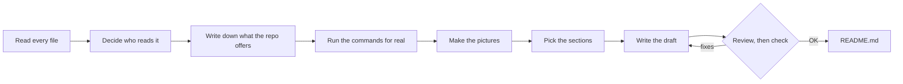

# 📘 GitHub README Writer

*Read every file, run every command, then write the README a stranger can use.*

**A skill for Claude (or any AI agent). It reads every file, runs every command, and writes a README with real output.**

  

**Status:** working, checked 2026-09-10. No LICENSE file yet.

## What is it?

Point it at a folder. You get a README a developer or PM can use with no prior context.

Two scripts do the mechanical work. `inventory.py` writes a checklist of every file. `lint.py`, the checker, fails the README on a broken link or filler word.

```bash
python3 inventory.py ~/Downloads/workflow-studio        # writes readme-inventory.md, a checklist of every file
python3 lint.py ~/Downloads/workflow-studio/README.md   # exit 1 on a broken link, bad anchor, placeholder, filler word
```

> Agent running this skill? Read [SKILL.md](SKILL.md), the procedure. This page is for the person choosing it.

## Why this and not a README template?

- **Nothing skipped.** You get a checklist of every file: size, kind, one-line summary. The writer checks off each line; an unchecked line is a gap.
- **Nothing invented.** Every command was run in a scratch folder. Every output is what it printed. [In the run below](#what-does-a-run-look-like), the imports turned up a `yaml` nobody had declared.
- **A second review that cuts.** A fresh reader ([CHALLENGER.md](CHALLENGER.md)) reads the draft on a 10-second, 60-second and 10-minute clock. It demands proof for every claim and cuts any section you would not miss.
- **A checker that fails.** [`lint.py`](lint.py) exits 1 on broken links, dead anchors, `<placeholder>` arguments and 28 filler words (`simply`, `powerful`…). It also fails a page with no first-screen command or License heading.
- **Reader first.** Before writing, the skill names who reads the page, what they came for, and what would make them leave. Those lines open [the checklist](readme-inventory.md).

## What is in the folder?

| File | What question it answers | Size |
|---|---|---|
| [`SKILL.md`](SKILL.md) | How is a README written? Seven steps and a menu of 38 sections, each with a "use when". Rules for monorepos, documents-only repos, existing READMEs, secrets, and commands that cannot be run. Ten anti-patterns. | 181 lines |
| [`CHALLENGER.md`](CHALLENGER.md) | Is the draft honest and short enough? Seven tests, including a plain-words read. Writes `readme-challenge.md`, a list of what to cut, prove, add, move, or reword. | 58 lines |
| [`inventory.py`](inventory.py) | What is in this repo? Finds 14 kinds of entry point (`main`s in Python, Node, Go, Rust, Java, Kotlin, C#, C, Ruby and shell; CLI parsers; web servers), 29 manifest types, npm scripts, Make and Just targets, Dockerfiles, CI, env examples, tests, agent instruction files, and non-stdlib Python imports. | 376 lines |
| [`lint.py`](lint.py) | Would a first-time reader trip over this README? | 190 lines |

## How does a run flow?

You get a README only after every file on the checklist is checked off and the checker prints `OK`.



## How do I install and use it?

You need Python 3.10–3.13, nothing else; the scripts are standard library only.

**In Claude (Cowork / Claude Code):** copy this folder to `~/.claude/skills/github-readme-writer/`. Then ask:

```
Write the README for ~/Downloads/workflow-studio using the github-readme-writer skill.
```

Not run for this README: it needs a Claude session.

**By hand, in any tool:** run the two scripts, then follow `SKILL.md` steps 2–7.

```bash
python3 inventory.py ~/Downloads/workflow-studio --out ~/Downloads/workflow-studio/readme-inventory.md
python3 lint.py ~/Downloads/workflow-studio/README.md --max-body-words 1800 --min-body-words 150
```

| Flag | Script | Default |
|---|---|---|
| `--out PATH` | `inventory.py` | `<repo>/readme-inventory.md` |
| `--max-body-words N` | `lint.py` | 1800 — a finding above it |
| `--min-body-words N` | `lint.py` | 150 — a warning below it |

## What does a run look like?

The target is `workflow-studio`, a 66-file framework for shipping a product with one PM and one AI. It sits next to this folder.

`inventory.py` printed:

```
wrote workflow-studio/readme-inventory.md (66 files listed, 3 folders skipped)
```

The checklist starts with a map of the repo:

```
## By top-level folder

- `framework/` — 48 files
- `(root)` — 7 files
- `tools/` — 5 files
- `workflows/` — 4 files
- `docs/` — 2 files
```

It ends with the undeclared dependency:

```
## Python imports that are not stdlib (verify each is declared)

`yaml`

Total: 66 files, 1,280,285 bytes listed; 0 symlinks; 3 folders not opened; 0 secret files not read.
```

`lint.py` on that repo's README:

```
OK — workflow-studio/README.md: 24 headings, 1793 body words, links and anchors resolve
```

And on a seven-line README with a dead link, a dead anchor, a `<name>` argument and two filler words:

```
warning: body prose is 11 words (< 150); fine for a tiny repo, otherwise the reader will not get context
6 finding(s) in bad/README.md:
  - line 3: link target does not exist: docs/guide.md
  - line 3: anchor #install matches no heading
  - line 6: placeholder '<name>' in a command — show a realistic argument
  - line 3: banned word 'simply': …A simply powerful tool. See [the…
  - line 3: banned word 'powerful': …A simply powerful tool. See [the docs] and…
  - no License section (say 'No license yet' if there is no LICENSE file)
```

Pass the wrong thing and the scripts say so. `inventory.py` given a file prints `not a directory (pass the repo folder, not a file): …` and exits 1. A missing path prints `does not exist: …`.

## What does a run leave behind?

1. `README.md`, plus `README.prev.md` if a README already existed.
2. The completed checklist, `readme-inventory.md`, and the review notes, `readme-challenge.md`. Keep for the next writer or delete before commit. This repo keeps its own: [checklist](readme-inventory.md), [review notes](readme-challenge.md), [previous README](README.prev.md).
3. A note to the owner: the reader, files read out of total, sections chosen and skipped, commands not run, claims dropped.

## What is it not?

Not a template generator: no README without reading the code. Not a docs site builder: prose beyond 1,800 words fails the checker and goes to `docs/`. Not a substitute for running the software: a command that cannot run is shown without output, with the reason. Not a secret scanner: it skips `.env` and key files but does not audit code for credentials. Not a browser: screenshots need Playwright or Chromium, not shipped here.

## Where did it come from?

The rules were distilled from eight READMEs: github/spec-kit, astral-sh/uv, fastapi/fastapi, httpie/cli, charmbracelet/gum, BurntSushi/ripgrep, openai/openai-agents-python and anthropics/claude-code. Then tested on [workflow-studio](https://github.com/rishabhrawat35/workflow-studio), whose first README was rejected for "showing nothing".

## License

No license yet.
