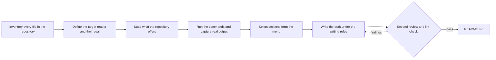

# GitHub README Writer

*It reads every file and runs every command before it writes one line of README.*

**GitHub README Writer is a skill for Claude and other AI agents that produces a README anyone opening a repository for the first time can act on, with every command and output taken from a real run.**

 

The skill works as described here and was last verified on 2026-09-10.

## Purpose and first command

The skill takes a repository folder and returns a README whose every claim was checked against the files. It is written for anyone opening a repository for the first time, who learns what the repository is, what it does, and how to run it without opening the code. Two Python scripts do the mechanical work:

```bash
python3 inventory.py ~/Downloads/workflow-studio        # writes readme-inventory.md, a checklist of every file
python3 lint.py ~/Downloads/workflow-studio/README.md   # rejects the README on a broken link, placeholder or filler word
```

> An AI agent running this skill reads [SKILL.md](SKILL.md), which holds the seven-step procedure. This page is for the person deciding whether to use it.

## Differences from a README template

- **Every file is read before writing begins.** The inventory script lists every file in the repository as a checklist, and the writer ticks each line only after opening the file. An unticked line is a gap in the README.
- **Every output block comes from a command that was run.** The commands are run in a scratch copy of the repository. In [the sample run below](#output-of-a-run-on-a-sample-repository), the import scan found a `yaml` dependency that no manifest declared.
- **A second review cuts what the reader would not miss.** [CHALLENGER.md](CHALLENGER.md) directs a reviewer who reads the draft on a 10-second, 60-second and 10-minute clock, demands proof for every claim, and scores the draft against ten acceptance criteria.
- **A checker rejects the README on the first fault.** `lint.py` exits 1 on a broken link, a dead anchor, a placeholder argument, one of 28 filler words, a missing first-screen command, or a missing License heading.
- **The reader is named before drafting starts.** The writer records who reads the page, what they came to do, and the doubt that would make them leave.

## Files in this folder

| File | Purpose | What it produces |
|---|---|---|
| [`SKILL.md`](SKILL.md) | It holds the seven-step procedure an agent follows, the writing rules, and a menu of 38 candidate sections, each marked with when it is used. | A run of it produces the README and an owner note. |
| [`CHALLENGER.md`](CHALLENGER.md) | It holds the tests and acceptance criteria for the second review of a draft. | The review produces `readme-challenge.md`, a list of cuts, proofs and rewordings with a pass or fail per criterion. |
| [`inventory.py`](inventory.py) | It walks a repository and lists every file. | It writes `readme-inventory.md`, the checklist the writer ticks while reading. |
| [`lint.py`](lint.py) | It checks a finished README against the rules. | It prints an `OK` line, or a list of faults followed by exit code 1. |

## The two scripts

| Script | Purpose | Output | Exit status |
|---|---|---|---|
| `inventory.py` | It records, for every file, its path, kind, first heading or docstring, and the entry points, manifests, build targets, CI workflows and test folders it detects; it also lists Python imports outside the standard library. | It writes `readme-inventory.md` in the repository, or at the path given by `--out`. | It exits 0 after writing, and 1 when the path does not exist or is not a folder. |
| `lint.py` | It checks links, images and anchors, code fences, placeholders, banned filler words, the first-screen command, the License heading and the body word count. | It prints one `OK` line, or one line per fault with its line number. | It exits 0 when no fault is found, and 1 otherwise. |

### What the inventory detects

| Detected item | Examples |
|---|---|
| Entry points in ten languages | Python, JavaScript and TypeScript, Go, Rust, Java, Kotlin, C#, C and C++, Ruby, shell |
| CLI argument parsers and web servers | `argparse`, `click`, `typer`, FastAPI, Flask, Express |
| Build and run targets | npm scripts and bin entries, Makefile and Justfile targets |
| Manifest files (29 types) | `pyproject.toml`, `Cargo.toml`, `go.mod` |
| Container and CI files | Dockerfiles, Compose files, GitHub Actions workflows |
| Repository conventions | test folders, `.env.example`, agent instruction files |
| Secret files | `.env`, key and credential files, listed but never read |

## How a run proceeds

The README is written only after every file on the checklist has been read, and it ships only after the review and the checker both pass.



## Installation and use

### Prerequisites

Python 3.10 or later is required (verified on 3.11). Both scripts use the standard library only, so nothing else is installed.

### Installation in Claude

In Cowork or Claude Code, copy this folder to `~/.claude/skills/github-readme-writer/`, then ask:

```
Write the README for ~/Downloads/workflow-studio using the github-readme-writer skill.
```

Not run while writing this README: it needs a Claude session.

### Manual use in any other tool

Run the two scripts, then follow the procedure in [SKILL.md](SKILL.md) from the point where the reader and goal are defined:

```bash
python3 inventory.py ~/Downloads/workflow-studio --out ~/Downloads/workflow-studio/readme-inventory.md
python3 lint.py ~/Downloads/workflow-studio/README.md --max-body-words 1800 --min-body-words 150
```

| Flag | Script | Effect | Default |
|---|---|---|---|
| `--out PATH` | `inventory.py` | The checklist is written to `PATH` instead of the repository. | `readme-inventory.md` in the repository |
| `--max-body-words N` | `lint.py` | A fault is reported when body prose exceeds `N` words. | 1800 |
| `--min-body-words N` | `lint.py` | A warning is printed when body prose is under `N` words. | 150 |

## Output of a run on a sample repository

The sample repository is [workflow-studio](https://github.com/rishabhrawat35/workflow-studio), a 66-file framework for shipping a product with one product manager and one AI. Every command below was run from a folder holding this skill and that repository side by side.

```bash
python3 github-readme-writer/inventory.py workflow-studio
```

```
wrote workflow-studio/readme-inventory.md (66 files listed, 3 folders skipped)
```

The checklist opens with a map of the repository by folder:

```bash
sed -n 5,11p workflow-studio/readme-inventory.md
```

```
## File count by top-level folder

- `framework/` — 48 files
- `(root)` — 7 files
- `tools/` — 5 files
- `workflows/` — 4 files
- `docs/` — 2 files
```

The last section of the checklist lists the dependency that no manifest declares:

```bash
grep -A2 '^## Python imports' workflow-studio/readme-inventory.md
```

```
## Python imports outside the standard library (verify that each is declared as a dependency)

`yaml`
```

The checker accepted that repository's README:

```bash
python3 github-readme-writer/lint.py workflow-studio/README.md
```

```
OK — workflow-studio/README.md: 24 headings, 1793 body words; every link and anchor resolves.
```

The checker rejected a seven-line README, saved as `bad/README.md` in the same folder, that contains a dead link, a dead anchor, a placeholder argument and two filler words:

<details>
<summary>The seven-line README that was checked</summary>

```bash
cat -n bad/README.md
```

````
     1	# Example tool
     2	
     3	A simply powerful tool. See [the docs](docs/guide.md) and [install](#install).
     4	
     5	```bash
     6	python3 tool.py <name>
     7	```
````

</details>

```bash
python3 github-readme-writer/lint.py bad/README.md
```

```
Warning: body prose is 11 words, below the minimum of 150; acceptable for a very small repository, otherwise the reader will lack context.
6 finding(s) in bad/README.md:
  - line 3: the link target does not exist: docs/guide.md
  - line 3: the anchor #install matches no heading.
  - line 6: the placeholder '<name>' appears in a command; show a realistic argument.
  - line 3: the banned word 'simply' appears in prose: …A simply powerful tool. See [the…
  - line 3: the banned word 'powerful' appears in prose: …A simply powerful tool. See [the docs] and…
  - No License heading exists; write 'No license yet' when the repository has no LICENSE file.
```

A wrong argument is refused with a message and exit code 1:

| Input | Message printed |
|---|---|
| A file passed to `inventory.py` | `The path is not a directory; pass the repository folder, not a file: …` |
| A path that does not exist, passed to either script | `The path does not exist: …` from `inventory.py`; `The path is not a file: …` from `lint.py` |

## Files a run leaves behind

1. `README.md`, and `README.prev.md` when a README already existed.
2. `readme-inventory.md`, the completed checklist, and `readme-challenge.md`, the review notes, kept for the next writer or deleted before commit. This folder keeps its own: [checklist](readme-inventory.md), [review notes](readme-challenge.md) and [previous README](README.prev.md).
3. A note to the owner stating the reader, the files read out of the total, the sections chosen and skipped, the commands not run, the claims dropped from the old README, and whether the second review was done by another agent or by the writer.

## Limits and non-goals

- It is not a template generator; no README is produced without reading the code.
- It is not a documentation site builder; body prose over 1,800 words fails the checker and belongs in `docs/`.
- It is not a substitute for running the software; a command that cannot run is shown without output, with the reason.
- It is not a secret scanner; it skips `.env` and key files but does not audit code for credentials.
- It is not a browser; screenshots need Playwright or Chromium, which are not shipped here.

## Sources of the rules

The section menu and writing rules follow the READMEs of eight projects: github/spec-kit, astral-sh/uv, fastapi/fastapi, httpie/cli, charmbracelet/gum, BurntSushi/ripgrep, openai/openai-agents-python and anthropics/claude-code.

## License

No license yet.
